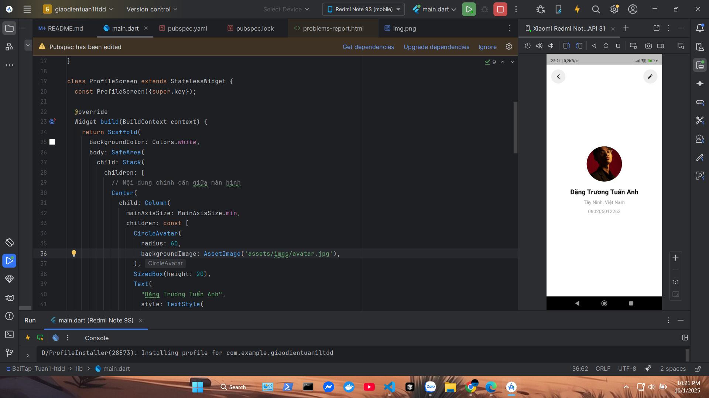

1. Công cụ sử dụng
Flutter: Framework chính để xây dựng ứng dụng di động, web và desktop bằng Dart.
Dart: Ngôn ngữ lập trình chính của Flutter.
Android Studio/VS Code: IDE hỗ trợ phát triển Flutter.
Gradle: Công cụ build cho Android.
CMake: Dùng để build ứng dụng trên Windows.
pubspec.yaml: Quản lý dependencies của dự án.
2. Quy trình build và chạy
Chạy lệnh flutter run để build và chạy ứng dụng.
Sử dụng flutter build apk hoặc flutter build windows để build cho từng nền tảng.

=> Giao diện khi code 

=> Giao diện output
